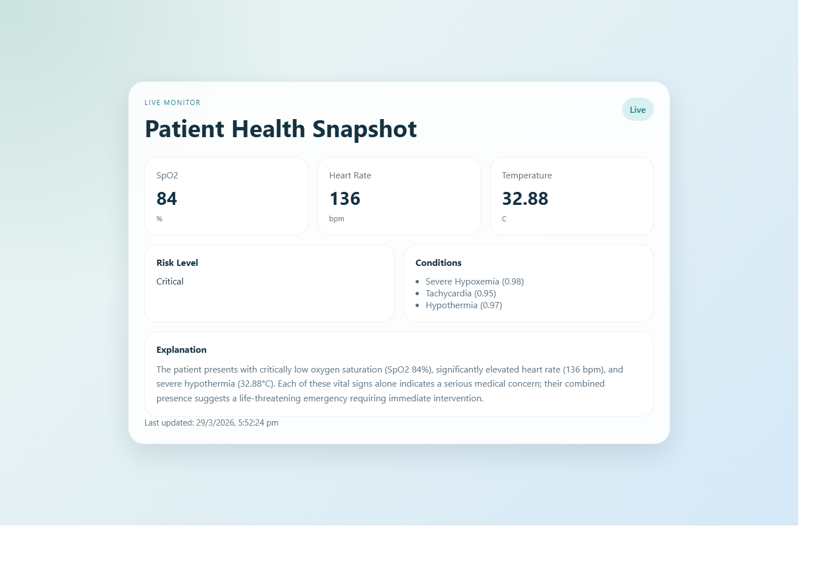
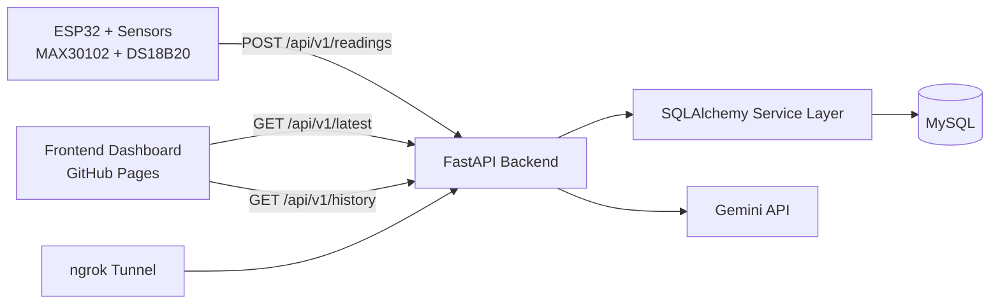

# IoT Health Monitoring System

An end-to-end IoT health monitoring project that collects patient vitals from an ESP32, stores readings in MySQL, generates AI-assisted clinical summaries with Gemini, and displays the latest patient status on a live dashboard.

## Live Demo

- Frontend: [GitHub Pages](https://sohamgulame.github.io/micro_project/)
- Backend: local FastAPI service exposed through ngrok during demo sessions

## Dashboard Preview



## Project Highlights

- Real-time vital ingestion from ESP32 using `MAX30102` and `DS18B20`
- FastAPI backend with modular route, service, and model layers
- MySQL persistence with SQLAlchemy ORM
- AI-generated risk assessment, condition summary, and explanation using Gemini
- REST API for latest reading, reading history, and health checks
- Responsive frontend dashboard with auto-refresh
- Free demo deployment path using GitHub Pages + local backend + ngrok tunnel

## System Architecture



## Core Features

### Backend
- `GET /health` returns service health
- `POST /api/v1/readings` validates and stores sensor data, then generates and stores a prediction
- `GET /api/v1/latest` returns the latest reading with prediction
- `GET /api/v1/history` returns the full reading history
- Environment-based configuration for database, AI, and CORS
- Startup table creation for `readings` and `predictions`

### Frontend
- Card-based dashboard UI
- Auto-refresh every 5 seconds
- Displays SpO2, heart rate, temperature, risk level, conditions, and explanation
- Configurable API base URL through `frontend/config.js`

### Embedded / ESP32
- Connects to Wi-Fi
- Collects live sensor values from `MAX30102` and `DS18B20`
- Sends readings to the backend every 10 seconds
- Includes reconnection and sensor-read checks

## Tech Stack

- **Backend:** FastAPI, SQLAlchemy, MySQL, Pydantic
- **AI:** Google Gemini API (`google-genai`)
- **Frontend:** HTML, CSS, JavaScript
- **Embedded:** ESP32 (Arduino), MAX30102, DS18B20
- **Deployment (demo):** GitHub Pages, ngrok

## Repository Structure

```text
micro_project/
+-- backend/
¦   +-- app/
¦       +-- main.py
¦       +-- database.py
¦       +-- models/
¦       +-- routes/
¦       +-- services/
+-- esp32/
¦   +-- health_monitor.ino
+-- frontend/
¦   +-- index.html
¦   +-- style.css
¦   +-- script.js
¦   +-- config.js
+-- docs/
¦   +-- assets/
¦   +-- project-showcase.md
+-- run_backend.bat
+-- run_ngrok.bat
+-- requirements.txt
```

## API Summary

| Method | Endpoint | Description |
|---|---|---|
| `GET` | `/health` | Service health check |
| `POST` | `/api/v1/readings` | Store a reading and generate prediction |
| `GET` | `/api/v1/latest` | Fetch the latest reading with prediction |
| `GET` | `/api/v1/history` | Fetch all stored readings |

### Example Reading Payload

```json
{
  "spo2": 97,
  "heart_rate": 78,
  "temperature": 36.7
}
```

## Local Setup

### 1. Install dependencies

```powershell
cd /d D:\CODES\project\micro_project
python -m pip install -r requirements.txt
```

### 2. Configure backend environment

Create `backend/.env` based on `backend/.env.example` and set:

```env
DB_USER=root
DB_PASSWORD=YOUR_PASSWORD
DB_HOST=localhost
DB_PORT=3306
DB_NAME=health_ai
GEMINI_API_KEY=YOUR_GEMINI_KEY
GEMINI_MODEL=gemini-2.5-flash
CORS_ORIGINS=http://127.0.0.1:5500
```

### 3. Run backend

```powershell
cd /d D:\CODES\project\micro_project
.\run_backend.bat
```

### 4. Run frontend locally

```powershell
cd /d D:\CODES\project\micro_project\frontend
python -m http.server 5500
```

### 5. Open the app

- Frontend: `http://127.0.0.1:5500/index.html`
- Backend health: `http://127.0.0.1:8000/health`

## ESP32 Notes

- Update `SERVER_URL` in `esp32/health_monitor.ino` to your current backend address
- For LAN testing, use your laptop's local IP
- For public demos, use your current ngrok HTTPS URL if needed
- Keep the sensor finger placement stable for better SpO2 and heart-rate quality

## Demo Deployment Flow

### Frontend
- Hosted on GitHub Pages using `.github/workflows/pages.yml`

### Backend
- Runs locally on the developer machine
- Exposed publicly with ngrok during demo sessions

### Important
- ngrok URLs change between sessions on the free tier
- Update `frontend/config.js` whenever the public backend URL changes

## Security Notes

- `backend/.env` is intentionally ignored and should never be committed
- Rotate any API key that has been pasted into chat or exposed publicly
- Do not expose MySQL directly to the internet

## Resume / Portfolio Angle

This project demonstrates:

- full-stack development across embedded systems, backend APIs, databases, and frontend UI
- real-time IoT ingestion and storage pipelines
- AI integration with structured outputs
- demo deployment using free hosting and tunneling tools
- production-minded concerns like env configuration, CORS, and separation of concerns

For a shorter project summary, see [Project Showcase](docs/project-showcase.md).
